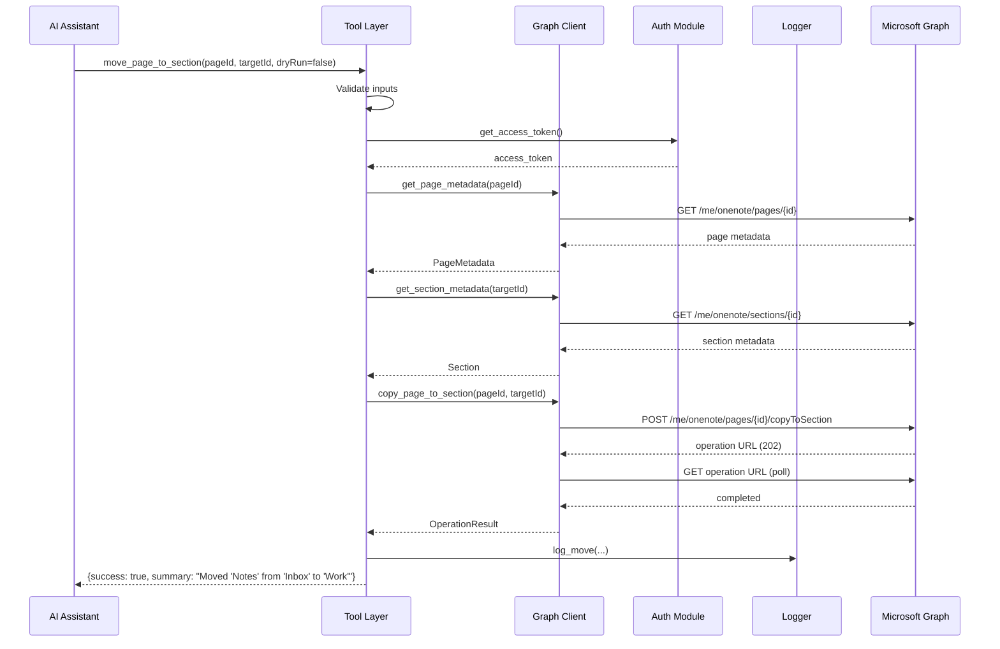
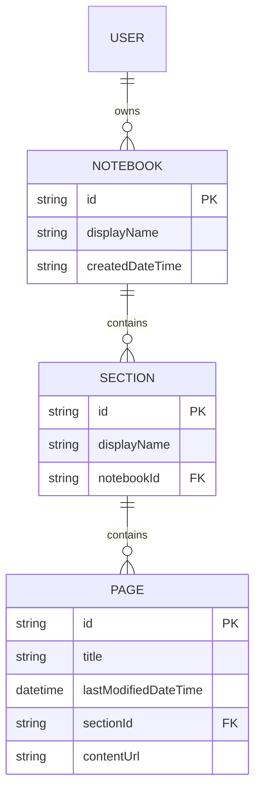
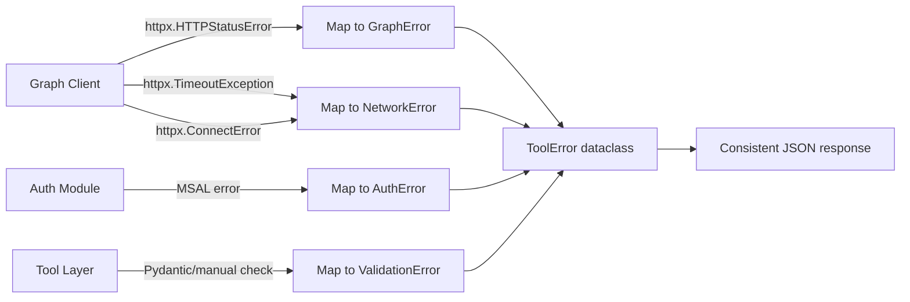

# Design Document: OneNote Organizer MCP Server

## Overview

The onenote-organizer is a Python MCP server that exposes OneNote notebook management capabilities to AI assistants via the Model Context Protocol. It authenticates users through Microsoft's device code OAuth 2.0 flow and communicates with the Microsoft Graph API to discover, read, and reorganize OneNote content.

The server is built on the official `mcp` Python SDK (FastMCP) which provides both stdio and HTTP/SSE transport out of the box. Authentication is handled by `msal` (Microsoft Authentication Library for Python), and all Graph API calls are made through `httpx` for async HTTP support.

### Key Design Decisions

1. **FastMCP over low-level Server** — FastMCP provides declarative tool registration via decorators, automatic schema generation from type hints, and built-in transport management. This eliminates boilerplate and keeps the codebase focused on business logic.

2. **httpx over requests/msgraph-sdk** — The official Microsoft Graph Python SDK adds heavy abstraction. Since we only use a small subset of OneNote endpoints, a thin httpx client with typed wrappers gives us full control, better testability, and lighter dependencies.

3. **MSAL for auth** — Microsoft's official auth library handles the device code flow, token caching, and silent refresh. It's the standard approach and handles edge cases (clock skew, token serialization) that a custom implementation would need to replicate.

4. **Copy-as-move pattern** — Microsoft Graph's OneNote API does not have a native "move page" operation. Moving a page requires `POST /pages/{id}/copyToSection` followed by polling the operation status. The original page remains in place after copy (OneNote does not support page deletion via API), so the "move" is semantically a copy to target section. This limitation is documented in responses.

5. **Clone-as-move workaround for personal accounts** — The `copyToSection` endpoint returns 501 "OData Feature not implemented" for personal Microsoft accounts. The workaround reads the page HTML (`GET /pages/{id}/content`), downloads all embedded images, and posts everything as multipart/form-data to the target section (`POST /sections/{id}/pages`), then deletes the original after verification. Pages are processed in reverse order sequentially to preserve original ordering (OneNote places newest pages at top).

6. **Section groups for hierarchical organization** — OneNote supports section groups (folders) that contain sections. This enables PARA-style organization where sections are grouped under Projects/, Areas/, Resources/, Archive/ instead of flat prefixed naming.

7. **Reorganization as two-phase** — Plan generation is read-only and produces a structured proposal. Execution is a separate tool call, enabling human-in-the-loop approval. This matches the safety-first philosophy.

## Architecture

```mermaid
graph TD
    subgraph "AI Assistant"
        Client[MCP Client]
    end

    subgraph "MCP Server Process"
        Transport[Transport Layer<br/>stdio | HTTP/SSE]
        Server[FastMCP Server]
        Tools[Tool Implementations]
        Auth[Auth Module]
        Graph[Graph Client]
        Logger[Operation Logger]
    end

    subgraph "External Services"
        AAD[Microsoft Entra ID<br/>OAuth 2.0]
        MSGraph[Microsoft Graph API<br/>OneNote endpoints]
    end

    Client <-->|JSON-RPC| Transport
    Transport <--> Server
    Server --> Tools
    Tools --> Auth
    Tools --> Graph
    Tools --> Logger
    Auth -->|Device Code Flow| AAD
    Graph -->|REST + Bearer Token| MSGraph
    Auth -.->|get_access_token| Graph
```

### Layered Architecture

The system follows a clean layered architecture:

1. **Transport Layer** — Managed by FastMCP. Handles stdio or HTTP/SSE based on startup configuration.
2. **Tool Layer** — Decorated async functions that validate inputs, orchestrate calls, and format responses.
3. **Graph Client Layer** — A thin async wrapper over httpx that handles pagination, error mapping, and request construction for OneNote endpoints.
4. **Auth Layer** — A self-contained module exposing `get_access_token()` that manages the device code flow, token caching, and silent refresh via MSAL.
5. **Cross-cutting** — Operation logging and dry-run mode are handled as shared concerns within the tool layer.

## Components and Interfaces

### 1. Auth Module (`auth.py`)

```python
from typing import Protocol

class AuthProvider(Protocol):
    """Interface for authentication providers."""
    
    async def get_access_token(self) -> str:
        """Return a valid access token or raise AuthError."""
        ...


class DeviceCodeAuthProvider:
    """MSAL-based device code flow authentication."""
    
    def __init__(self, client_id: str, tenant_id: str = "common"):
        ...
    
    async def get_access_token(self) -> str:
        """
        1. Try acquire_token_silent with cached account
        2. If no cache or expired refresh token, initiate device code flow
        3. Return access token string
        Raises: AuthError if flow fails or times out
        """
        ...
    
    def _get_token_cache_path(self) -> Path:
        """Return platform-appropriate path for encrypted token cache."""
        ...
```

**Key details:**
- Uses `msal.PublicClientApplication` with a serializable `SerializableTokenCache`
- Token cache is persisted to disk encrypted with a local machine key (using `cryptography.Fernet` with a key derived from machine-specific data)
- Reads `AZURE_CLIENT_ID` (required) and `AZURE_TENANT_ID` (optional, defaults to "common") from environment
- Scopes: `["Notes.Read", "Notes.ReadWrite"]`

### 2. Graph Client (`graph_client.py`)

```python
class GraphClient:
    """Async Microsoft Graph client for OneNote operations."""
    
    BASE_URL = "https://graph.microsoft.com/v1.0"
    
    def __init__(self, auth_provider: AuthProvider):
        self._auth = auth_provider
        self._client = httpx.AsyncClient(timeout=30.0)
    
    async def list_notebooks(self) -> list[Notebook]:
        """GET /me/onenote/notebooks with pagination."""
        ...
    
    async def list_sections(self, notebook_id: str) -> list[Section]:
        """GET /me/onenote/notebooks/{id}/sections with pagination."""
        ...
    
    async def list_pages(self, section_id: str) -> list[PageMetadata]:
        """GET /me/onenote/sections/{id}/pages with pagination."""
        ...
    
    async def get_page_content(self, page_id: str) -> str:
        """GET /me/onenote/pages/{id}/content (returns HTML)."""
        ...
    
    async def copy_page_to_section(self, page_id: str, target_section_id: str) -> str:
        """POST /me/onenote/pages/{id}/copyToSection. Returns operation URL."""
        ...
    
    async def poll_operation(self, operation_url: str) -> OperationResult:
        """Poll long-running operation until complete or failed."""
        ...
    
    async def update_page_title(self, page_id: str, new_title: str) -> None:
        """PATCH /me/onenote/pages/{id}/content with title replacement."""
        ...
    
    async def create_section(self, notebook_id: str, display_name: str) -> Section:
        """POST /me/onenote/notebooks/{id}/sections."""
        ...
    
    async def get_page_metadata(self, page_id: str) -> PageMetadata:
        """GET /me/onenote/pages/{id} for metadata lookup."""
        ...
    
    async def get_section_metadata(self, section_id: str) -> Section:
        """GET /me/onenote/sections/{id} for metadata lookup."""
        ...

    async def _paginated_get(self, url: str) -> list[dict]:
        """Follow @odata.nextLink until all results retrieved."""
        ...
    
    async def _request(self, method: str, url: str, **kwargs) -> httpx.Response:
        """Execute authenticated request with error mapping."""
        ...
```

### 3. Data Models (`models.py`)

```python
from dataclasses import dataclass
from datetime import datetime

@dataclass(frozen=True)
class Notebook:
    id: str
    display_name: str

@dataclass(frozen=True)
class Section:
    id: str
    display_name: str
    notebook_id: str | None = None

@dataclass(frozen=True)
class PageMetadata:
    id: str
    title: str
    last_modified: datetime
    section_id: str | None = None

@dataclass(frozen=True)
class PageContent:
    id: str
    title: str
    content: str

@dataclass(frozen=True)
class SuggestedSection:
    display_name: str
    notebook_id: str

@dataclass(frozen=True)
class PageMove:
    page_id: str
    source_section_id: str
    target_section_display_name: str

@dataclass(frozen=True)
class ReorganizationPlan:
    suggested_sections: list[SuggestedSection]
    page_moves: list[PageMove]

@dataclass(frozen=True)
class ToolResult:
    success: bool
    summary: str
    dry_run: bool = False
    data: dict | None = None
    error: ToolError | None = None

@dataclass(frozen=True)
class ToolError:
    category: str  # "graph_error" | "auth_error" | "validation_error" | "network_error"
    message: str
    status_code: int | None = None
    tool_name: str = ""
    invalid_fields: dict[str, str] | None = None  # field -> reason (for validation errors)

@dataclass(frozen=True)
class OperationResult:
    status: str  # "completed" | "failed"
    resource_id: str | None = None
    error_message: str | None = None
```

### 4. Operation Logger (`logger.py`)

```python
class OperationLogger:
    """Structured logging for write operations."""
    
    def __init__(self, destination: str = "stdout"):
        """
        destination: file path or "stdout"
        Falls back to stderr if configured destination is not writable.
        """
        ...
    
    def log_move(self, page_id: str, source_section_id: str, 
                 target_section_id: str, success: bool, summary: str) -> None:
        ...
    
    def log_rename(self, page_id: str, old_title: str, 
                   new_title: str, success: bool, summary: str) -> None:
        ...
    
    def log_apply_plan(self, notebook_id: str, sections_created: int,
                       pages_moved: int, errors: list[str], summary: str) -> None:
        ...
```

**Log format:** Single-line structured text:
```
2024-01-15T10:30:00+00:00 | move_page_to_section | success | page=abc123 source=sec001 target=sec002 | Moved "Meeting Notes" from "Inbox" to "Work"
```

### 5. MCP Server & Tools (`server.py`)

```python
from mcp.server.fastmcp import FastMCP

mcp = FastMCP("onenote-organizer")

@mcp.tool()
async def list_notebooks() -> list[dict]:
    """List all OneNote notebooks for the authenticated user."""
    ...

@mcp.tool()
async def list_sections(notebook_id: str) -> list[dict]:
    """List all sections in a specific notebook."""
    ...

@mcp.tool()
async def list_pages(section_id: str) -> list[dict]:
    """List all pages in a specific section."""
    ...

@mcp.tool()
async def get_page_content(page_id: str, format: str = "html") -> dict:
    """Get the content of a specific page."""
    ...

@mcp.tool()
async def move_page_to_section(page_id: str, target_section_id: str, 
                                dry_run: bool = False) -> dict:
    """Move a page to a different section."""
    ...

@mcp.tool()
async def rename_page(page_id: str, new_title: str, 
                      dry_run: bool = False) -> dict:
    """Rename a page with a new title."""
    ...

@mcp.tool()
async def create_section_group(notebook_id: str, display_name: str) -> dict:
    """Create a section group (folder) in a notebook for hierarchical organization."""
    ...

@mcp.tool()
async def create_section_in_group(section_group_id: str, display_name: str) -> dict:
    """Create a section inside a section group."""
    ...

@mcp.tool()
async def list_section_groups(notebook_id: str) -> list[dict]:
    """List all section groups (folders) in a notebook."""
    ...

@mcp.tool()
async def delete_page(page_id: str, dry_run: bool = False) -> dict:
    """Delete a page from OneNote (cannot be recovered)."""
    ...

@mcp.tool()
async def clone_page_to_section(page_id: str, target_section_id: str,
                                 delete_source: bool = True, dry_run: bool = False) -> dict:
    """Clone/move a page (personal account workaround for 501 copyToSection)."""
    ...

@mcp.tool()
async def bulk_plan_reorganization(notebook_id: str, 
                                    strategy: str = "by_topic") -> dict:
    """Generate a reorganization plan for a notebook."""
    ...

@mcp.tool()
async def apply_reorganization_plan(plan: dict, dry_run: bool = False,
                                     batch_size: int = 10, offset: int = 0) -> dict:
    """Execute an approved reorganization plan (batched for large plans)."""
    ...
```

### 6. Entry Point (`__main__.py`)

```python
import sys
import argparse

def main():
    parser = argparse.ArgumentParser(description="OneNote Organizer MCP Server")
    parser.add_argument("--transport", choices=["stdio", "http"], default="stdio")
    parser.add_argument("--port", type=int, default=8080)
    args = parser.parse_args()
    
    if args.transport == "stdio":
        mcp.run(transport="stdio")
    elif args.transport == "http":
        mcp.run(transport="sse", port=args.port)
```

### Component Interaction Diagram



## Data Models

### Microsoft Graph OneNote Entity Relationships



### Internal State

The server is stateless between tool invocations. All state lives externally:
- **Authentication state** — MSAL token cache persisted to encrypted file
- **Notebook data** — Always fetched fresh from Microsoft Graph (no local caching)
- **Operation log** — Append-only file or stdout stream

### Reorganization Plan Schema

```json
{
  "suggestedSections": [
    {"displayName": "Work Projects", "notebookId": "nb-123"}
  ],
  "pageMoves": [
    {
      "pageId": "pg-456",
      "sourceSectionId": "sec-789",
      "targetSectionDisplayName": "Work Projects"
    }
  ]
}
```

### Error Response Schema

```json
{
  "success": false,
  "error": {
    "category": "graph_error",
    "statusCode": 404,
    "message": "The notebook was not found",
    "toolName": "list_sections"
  }
}
```

### Environment Variables

| Variable | Required | Default | Description |
|----------|----------|---------|-------------|
| `AZURE_CLIENT_ID` | Yes | — | App registration client ID |
| `AZURE_TENANT_ID` | No | `"common"` | Azure AD tenant ID |
| `ONENOTE_LOG_DESTINATION` | No | `"stdout"` | Log file path or "stdout" |

## Correctness Properties

*A property is a characteristic or behavior that should hold true across all valid executions of a system — essentially, a formal statement about what the system should do. Properties serve as the bridge between human-readable specifications and machine-verifiable correctness guarantees.*

### Property 1: Token Encryption Round-Trip

*For any* valid token string, encrypting it with the Token_Store and then decrypting the result should produce the original token string.

**Validates: Requirements 2.5**

### Property 2: Pagination Collects All Items

*For any* paginated Microsoft Graph response containing N total items spread across multiple pages (each with an `@odata.nextLink`), the pagination logic should collect exactly N items with no duplicates and no omissions.

**Validates: Requirements 4.1, 5.1, 6.1**

### Property 3: List/Get Response Shape Invariant

*For any* valid Graph API response containing notebook, section, or page entities, the tool response should contain objects with all required fields (id + displayName for notebooks/sections; id + title + lastModifiedDateTime for pages; id + title + content for page content) and no fields should be null.

**Validates: Requirements 4.2, 5.2, 6.2, 7.4**

### Property 4: Graph Error Mapping Consistency

*For any* HTTP error response from Microsoft Graph (with any status code and error message), the MCP server should produce a structured error containing the HTTP status code, the error message, the tool name that produced the error, and the category code "graph_error".

**Validates: Requirements 4.4, 7.7, 15.1, 15.4**

### Property 5: Input Validation Rejects Invalid Parameters

*For any* tool invocation where a required parameter is missing, empty, whitespace-only, exceeds its maximum length, or is not a member of an allowed set of values, the MCP server should return a validation error with category "validation_error" listing each invalid field name paired with a reason describing the specific constraint violated.

**Validates: Requirements 5.5, 6.5, 7.6, 9.4, 10.9, 15.3**

### Property 6: HTML-to-Text Stripping Preserves Visible Content

*For any* valid HTML document, converting it to text format should produce output that contains no HTML tags (no `<` followed by a tag name followed by `>`) and preserves all visible text content from the original HTML.

**Validates: Requirements 7.2**

### Property 7: Dry-Run Invariant

*For any* write tool (move_page_to_section, rename_page, apply_reorganization_plan) invoked with dryRun set to true and any valid inputs, the server should: (a) make zero create/update/delete HTTP requests to Microsoft Graph, (b) include a `dryRun` field set to true in the response, and (c) return the same set of top-level response fields as live execution.

**Validates: Requirements 8.4, 9.5, 11.6, 12.1, 12.2, 12.3**

### Property 8: Human-Readable Summary Format

*For any* successful write operation (live or dry-run), the response summary field should: reference entities by display name or title (not by ID), contain no technical identifiers (UUIDs, timestamps, section IDs), be written in plain English, and not exceed 256 characters in length.

**Validates: Requirements 8.2, 9.2, 14.1, 14.3**

### Property 9: Dry-Run Summary Prefix

*For any* write tool invoked in dry-run mode that produces a summary, the summary string should begin with the word "Would".

**Validates: Requirements 14.2**

### Property 10: Date-Range Grouping Coherence

*For any* set of pages with lastModifiedDateTime values, when grouped using the "by_date" strategy, all pages within the same suggested section should have dates that fall within a single contiguous date range, and no two suggested sections should have overlapping date ranges.

**Validates: Requirements 10.3**

### Property 11: Reorganization Plan Schema Validity

*For any* valid notebook containing sections and pages, the bulk_plan_reorganization tool should return a plan where: every object in suggestedSections contains displayName and notebookId fields, and every object in pageMoves contains pageId, sourceSectionId, and targetSectionDisplayName fields.

**Validates: Requirements 10.6**

### Property 12: Apply Summary Contains Operation Counts

*For any* execution of apply_reorganization_plan (live or dry-run), the summary should contain the numeric count of sections created and pages moved, and these counts should equal the actual number of successful section creations and page moves performed (or projected).

**Validates: Requirements 11.4, 14.4**

### Property 13: Partial Failure Continues Processing

*For any* reorganization plan where some operations fail, the apply_reorganization_plan tool should attempt all remaining operations (skipping only page moves targeting a failed section), and the error summary should list every individual failure encountered.

**Validates: Requirements 11.5**

### Property 14: Invalid Plan References Block All Writes

*For any* reorganization plan containing references to non-existent pages or notebooks, the apply_reorganization_plan tool should return an error listing all invalid references and should make zero create/update/delete requests to Microsoft Graph.

**Validates: Requirements 11.8**

### Property 15: Log Entry Structure and Format

*For any* write operation that is executed (not dry-run), the log entry should: be exactly one line (no newline characters within the entry), contain an ISO 8601 timestamp with timezone offset, the tool name, the operation outcome, all resource identifiers specific to the tool, and a human-readable description not exceeding 200 characters.

**Validates: Requirements 13.1, 13.4**

## Error Handling

### Error Categories

| Category | When | HTTP Status | Additional Fields |
|----------|------|-------------|-------------------|
| `graph_error` | Microsoft Graph returns HTTP 4xx/5xx | From Graph response | message from Graph |
| `auth_error` | Token acquisition fails | N/A | verification URL, instructions |
| `validation_error` | Tool input doesn't match schema | N/A | invalid_fields: {field: reason} |
| `network_error` | Connection timeout or DNS failure | N/A | generic connectivity message |

### Error Propagation Strategy



### Error Handling Rules

1. **Never expose raw exceptions** — All exceptions from httpx, MSAL, or internal code are caught and mapped to one of the four category codes.
2. **Graph errors pass through status + message** — The original Graph error message is preserved for debugging.
3. **Validation errors are field-level** — Each invalid field gets its own reason string explaining what constraint was violated.
4. **Auth errors include recovery instructions** — The response always tells the user how to re-authenticate.
5. **Network errors are generic** — No internal details (stack traces, endpoint URLs) leak into the response.
6. **Log failures never interrupt operations** — If the logger fails to write, it falls back to stderr silently and the tool operation continues.

### Retry Policy

- **No automatic retries for user-facing tool calls** — The AI assistant can retry if needed.
- **Operation polling** (copyToSection) — Poll with exponential backoff (1s, 2s, 4s, 8s) up to 60 seconds, then return a timeout error.

## Testing Strategy

### Testing Approach

The project uses a dual testing strategy:

1. **Property-based tests** (via `hypothesis`) — Verify universal correctness properties across randomly generated inputs. Each property from the Correctness Properties section maps to one property-based test.
2. **Unit tests** (via `pytest`) — Verify specific examples, edge cases, integration wiring, and error conditions.

### Property-Based Testing Configuration

- **Library**: `hypothesis` (Python's standard PBT library)
- **Minimum iterations**: 100 per property (via `@settings(max_examples=100)`)
- **Tag format**: Comment above each test: `# Feature: onenote-organizer, Property {N}: {title}`

### Test Organization

```
tests/
├── conftest.py              # Shared fixtures (mock Graph client, mock auth)
├── test_properties/
│   ├── test_encryption.py   # Property 1: Token round-trip
│   ├── test_pagination.py   # Property 2: Pagination completeness
│   ├── test_response_shape.py  # Property 3: Response shape
│   ├── test_error_mapping.py   # Property 4: Error mapping
│   ├── test_validation.py      # Property 5: Input validation
│   ├── test_html_strip.py      # Property 6: HTML stripping
│   ├── test_dry_run.py         # Properties 7, 9: Dry-run invariant + prefix
│   ├── test_summary.py         # Properties 8, 12: Summary format + counts
│   ├── test_date_grouping.py   # Property 10: Date grouping
│   ├── test_plan_schema.py     # Property 11: Plan schema
│   ├── test_partial_failure.py # Property 13: Partial failure
│   ├── test_plan_validation.py # Property 14: Invalid refs
│   └── test_log_format.py      # Property 15: Log format
├── test_unit/
│   ├── test_auth.py         # Auth module unit tests
│   ├── test_graph_client.py # Graph client unit tests
│   ├── test_tools.py        # Tool logic unit tests
│   └── test_logger.py       # Logger unit tests
└── test_integration/
    └── test_server.py       # Transport startup, manifest, end-to-end
```

### Mocking Strategy

- **Microsoft Graph** — All Graph API calls are mocked using `httpx`-compatible mock transports (or `respx` library). No real network calls in property or unit tests.
- **MSAL** — Mocked at the `PublicClientApplication` level. Tests never trigger real OAuth flows.
- **File system** — Token cache and log file tests use `tmp_path` pytest fixtures.

### Key Unit Test Scenarios

| Scenario | Tests |
|----------|-------|
| Auth flow: missing AZURE_CLIENT_ID | Verify error raised before any MSAL call |
| Auth flow: corrupted token cache | Verify device code flow re-initiated |
| Auth flow: expired refresh token | Verify silent fails → device code flow |
| Move: same source and target section | Verify no-op response |
| Rename: title unchanged | Verify no-op response |
| Apply: section creation fails | Verify page moves to that section are skipped |
| Logger: unwritable path | Verify fallback to stderr |
| Transport: invalid flag | Verify error + non-zero exit |
| Transport: default (no flag) | Verify stdio mode |

