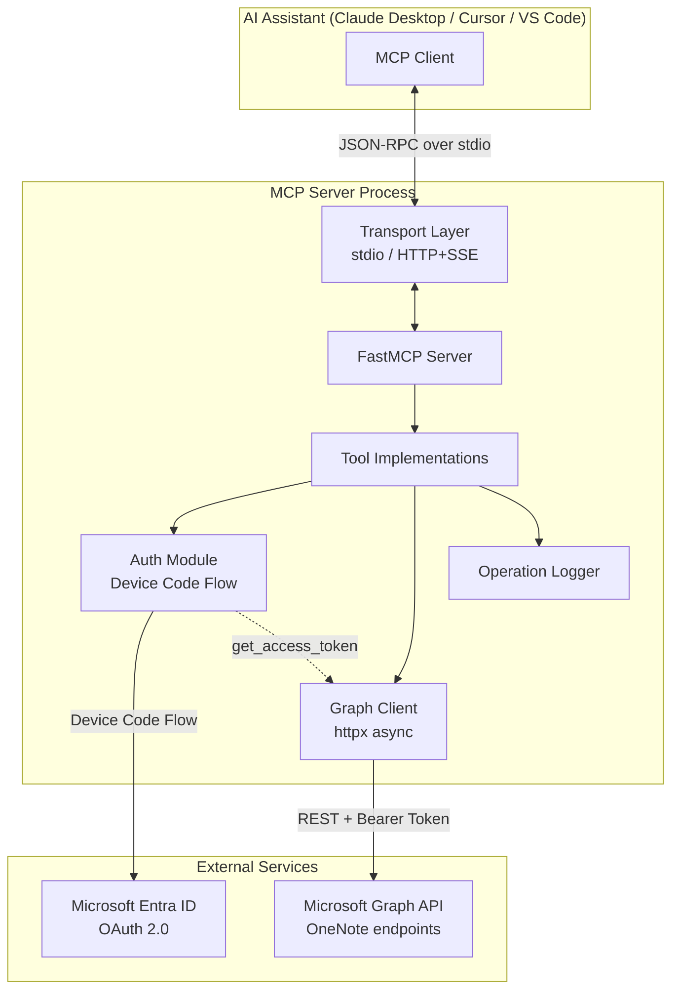
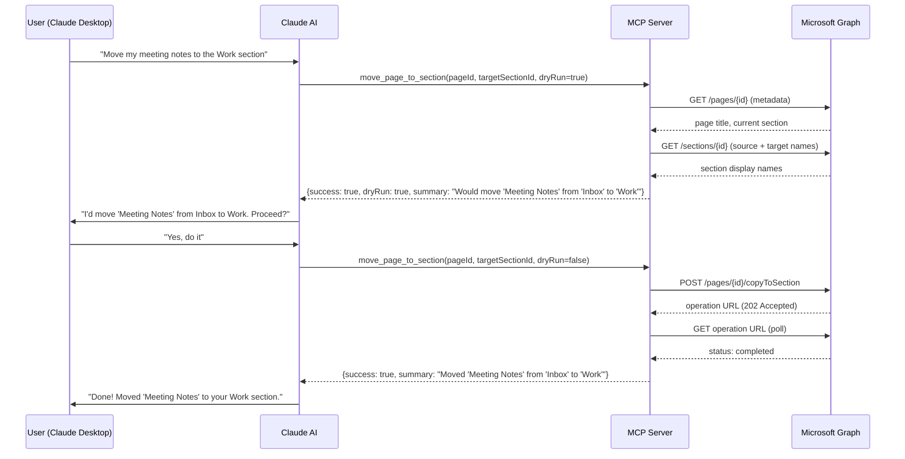

# OneNote Organizer MCP Server

An AI-powered Model Context Protocol (MCP) server that lets AI assistants like Claude discover, read, and reorganize your personal Microsoft OneNote notebooks.

## Background

Managing personal OneNote notebooks tends to accumulate clutter over time — pages get dumped into generic sections, naming becomes inconsistent, and finding information gets harder. This MCP server bridges the gap between AI assistants and the OneNote API, enabling conversational notebook organization.

The server exposes a set of tools that allow an AI assistant to:
- **Browse** your notebook hierarchy (notebooks → sections → pages)
- **Read** page content for analysis
- **Reorganize** by moving pages, renaming them, or executing bulk plans
- **Preview** all changes via dry-run before committing

It uses Microsoft Graph for OneNote access, authenticates via device code flow (no password storage), and follows a safety-first philosophy: all destructive operations support dry-run previews and are fully logged.

## Architecture



### Layered Architecture

| Layer | Responsibility | Key Tech |
|-------|---------------|----------|
| Transport | stdio or HTTP/SSE communication | FastMCP |
| Tools | Input validation, orchestration, response formatting | Python async |
| Graph Client | Pagination, error mapping, REST call construction | httpx |
| Auth | Device code flow, token caching, silent refresh | MSAL + Fernet |
| Logger | Structured audit logging for all write operations | stdlib |

## Sequence Diagram — Page Move



## Project Structure

```
onenote_organizer/
├── __init__.py          # Package marker
├── __main__.py          # CLI entry point (transport selection)
├── server.py            # FastMCP server + all 8 tool implementations
├── auth.py              # AuthProvider Protocol + DeviceCodeAuthProvider (MSAL)
├── graph_client.py      # Async Microsoft Graph client (httpx)
├── logger.py            # Structured operation logging
└── models.py            # Frozen dataclasses + custom exceptions
```

## Prerequisites

- **Python 3.11+** (works on macOS, Windows, and Linux)
- **Azure App Registration** (see setup guide below)

### Platform Compatibility

| Platform | Status | Python command | Venv activation |
|----------|--------|---------------|-----------------|
| macOS | ✅ Fully supported | `python3` | `source .venv/bin/activate` |
| Windows | ✅ Fully supported | `python` | `.venv\Scripts\activate` |
| Linux | ✅ Fully supported | `python3` | `source .venv/bin/activate` |

## Setting Up Azure App Registration

Follow these steps to create the required app registration in the Azure Portal:

### Step 1: Create the App Registration

1. Go to [Azure Portal](https://portal.azure.com) → **Microsoft Entra ID** → **App registrations**
2. Click **New registration**
3. Fill in:
   - **Name**: `OneNote Organizer MCP` (or any name you prefer)
   - **Supported account types**: Choose "Accounts in any organizational directory and personal Microsoft accounts"
   - **Redirect URI**: Leave blank (not needed for device code flow)
4. Click **Register**
5. On the overview page, copy the **Application (client) ID** — this is your `AZURE_CLIENT_ID`

### Step 2: Configure API Permissions

1. In your app registration, go to **API permissions** → **Add a permission**
2. Select **Microsoft Graph** → **Delegated permissions**
3. Search for and add:
   - `Notes.Read`
   - `Notes.ReadWrite`
4. Click **Add permissions**
5. (Optional) If using an organizational account, click **Grant admin consent** — for personal accounts this isn't needed

### Step 3: Enable Public Client Flows

1. Go to **Authentication** in the left sidebar
2. Scroll to **Advanced settings**
3. Set **Allow public client flows** to **Yes**
4. Click **Save**

### Step 4: Note Your Configuration

You now have everything needed:

| Setting | Where to find it | Used as |
|---------|------------------|---------|
| Application (client) ID | App registration → Overview | `AZURE_CLIENT_ID` |
| Directory (tenant) ID | App registration → Overview | `AZURE_TENANT_ID` (optional) |

> **Personal Microsoft accounts**: Use `AZURE_TENANT_ID=common` (the default). This covers @outlook.com, @hotmail.com, @live.com accounts.
>
> **Work/School accounts**: Use your organization's tenant ID from the Overview page.

## Installation

### macOS

```bash
cd /path/to/OneNoteMcp

# Create virtual environment
python3 -m venv .venv
source .venv/bin/activate

# Install the package
pip install -e .
```

### Windows

```powershell
cd C:\path\to\OneNoteMcp

# Create virtual environment
python -m venv .venv
.venv\Scripts\activate

# Install the package
pip install -e .
```

> **Note**: On Windows, use `python` (not `python3`). Ensure Python 3.11+ is on your PATH.

## Environment Variables

| Variable | Required | Default | Description |
|----------|----------|---------|-------------|
| `AZURE_CLIENT_ID` | Yes | — | Your Azure app registration client ID |
| `AZURE_TENANT_ID` | No | `common` | Azure AD tenant (use `common` for personal Microsoft accounts) |
| `ONENOTE_LOG_DESTINATION` | No | `stderr` | Log output: file path, `stdout`, or `stderr` |

## Running the Server

### macOS

```bash
# Activate the virtual environment
source /path/to/OneNoteMcp/.venv/bin/activate

# Run in stdio mode (default — used by Claude Desktop)
python -m onenote_organizer

# Or using the installed console script
onenote-organizer

# HTTP/SSE mode (for remote clients)
python -m onenote_organizer --transport http --port 8080
```

### Windows

```powershell
# Activate the virtual environment
C:\path\to\OneNoteMcp\.venv\Scripts\activate

# Run in stdio mode (default — used by Claude Desktop)
python -m onenote_organizer

# Or using the installed console script
onenote-organizer

# HTTP/SSE mode (for remote clients)
python -m onenote_organizer --transport http --port 8080
```

## Connecting from Claude Desktop

### macOS

**Config file location**: `~/Library/Application Support/Claude/claude_desktop_config.json`

```json
{
  "mcpServers": {
    "onenote-organizer": {
      "command": "/path/to/OneNoteMcp/.venv/bin/python",
      "args": ["-m", "onenote_organizer"],
      "env": {
        "AZURE_CLIENT_ID": "your-azure-client-id-here",
        "AZURE_TENANT_ID": "common"
      }
    }
  }
}
```

**Example** (using a real path):
```json
{
  "mcpServers": {
    "onenote-organizer": {
      "command": "/Users/yourname/Projects/OneNoteMcp/.venv/bin/python",
      "args": ["-m", "onenote_organizer"],
      "env": {
        "AZURE_CLIENT_ID": "a1b2c3d4-e5f6-7890-abcd-ef1234567890",
        "AZURE_TENANT_ID": "common"
      }
    }
  }
}
```

**View MCP logs**:
```bash
tail -f ~/Library/Logs/Claude/mcp-server-onenote-organizer.log
```

### Windows

**Config file location**: `%APPDATA%\Claude\claude_desktop_config.json`

Typically: `C:\Users\YourName\AppData\Roaming\Claude\claude_desktop_config.json`

```json
{
  "mcpServers": {
    "onenote-organizer": {
      "command": "C:\\path\\to\\OneNoteMcp\\.venv\\Scripts\\python.exe",
      "args": ["-m", "onenote_organizer"],
      "env": {
        "AZURE_CLIENT_ID": "your-azure-client-id-here",
        "AZURE_TENANT_ID": "common"
      }
    }
  }
}
```

**Example** (using a real path):
```json
{
  "mcpServers": {
    "onenote-organizer": {
      "command": "C:\\Users\\YourName\\Projects\\OneNoteMcp\\.venv\\Scripts\\python.exe",
      "args": ["-m", "onenote_organizer"],
      "env": {
        "AZURE_CLIENT_ID": "a1b2c3d4-e5f6-7890-abcd-ef1234567890",
        "AZURE_TENANT_ID": "common"
      }
    }
  }
}
```

> **Important on Windows**: Use double backslashes (`\\`) in JSON paths, and point to `python.exe` inside `.venv\Scripts\`.

**View MCP logs**: Check `%APPDATA%\Claude\Logs\` for log files.

### After Configuration (both platforms)

1. **Save** the config file
2. **Restart Claude Desktop** completely (quit and reopen)
3. Look for the **hammer icon** (🔨) in the chat — it shows available MCP tools
4. **First use**: When you invoke any tool, the server starts device code authentication:
   - Check MCP logs for the device code and URL
   - Visit https://microsoft.com/devicelogin
   - Enter the code and sign in with your Microsoft account
   - The token is cached — future sessions authenticate silently

### Alternative: Using the console script

After `pip install -e .`, you can reference the script directly:

**macOS**:
```json
{
  "mcpServers": {
    "onenote-organizer": {
      "command": "/path/to/OneNoteMcp/.venv/bin/onenote-organizer",
      "env": { "AZURE_CLIENT_ID": "your-client-id" }
    }
  }
}
```

**Windows**:
```json
{
  "mcpServers": {
    "onenote-organizer": {
      "command": "C:\\path\\to\\OneNoteMcp\\.venv\\Scripts\\onenote-organizer.exe",
      "env": { "AZURE_CLIENT_ID": "your-client-id" }
    }
  }
}
```

## Connecting from Other Clients

### Cursor (macOS)

Add to `.cursor/mcp.json`:

```json
{
  "mcpServers": {
    "onenote-organizer": {
      "command": "/path/to/OneNoteMcp/.venv/bin/python",
      "args": ["-m", "onenote_organizer"],
      "env": {
        "AZURE_CLIENT_ID": "your-azure-client-id-here"
      }
    }
  }
}
```

### Cursor (Windows)

```json
{
  "mcpServers": {
    "onenote-organizer": {
      "command": "C:\\path\\to\\OneNoteMcp\\.venv\\Scripts\\python.exe",
      "args": ["-m", "onenote_organizer"],
      "env": {
        "AZURE_CLIENT_ID": "your-azure-client-id-here"
      }
    }
  }
}
```

### VS Code / Copilot (macOS)

Add to `.vscode/mcp.json`:

```json
{
  "servers": {
    "onenote-organizer": {
      "command": "/path/to/OneNoteMcp/.venv/bin/python",
      "args": ["-m", "onenote_organizer"],
      "env": {
        "AZURE_CLIENT_ID": "your-azure-client-id-here"
      }
    }
  }
}
```

### VS Code / Copilot (Windows)

```json
{
  "servers": {
    "onenote-organizer": {
      "command": "C:\\path\\to\\OneNoteMcp\\.venv\\Scripts\\python.exe",
      "args": ["-m", "onenote_organizer"],
      "env": {
        "AZURE_CLIENT_ID": "your-azure-client-id-here"
      }
    }
  }
}
```

## Available Tools

| Tool | Description | Inputs |
|------|-------------|--------|
| `list_notebooks` | List all OneNote notebooks | — |
| `list_sections` | List sections in a notebook | `notebook_id` |
| `list_pages` | List pages in a section | `section_id` |
| `get_page_content` | Read page content | `page_id`, `format` (html/text) |
| `move_page_to_section` | Move a page to another section | `page_id`, `target_section_id`, `dry_run` |
| `rename_page` | Rename a page | `page_id`, `new_title`, `dry_run` |
| `bulk_plan_reorganization` | Generate a reorganization plan | `notebook_id`, `strategy` |
| `apply_reorganization_plan` | Execute a reorganization plan | `plan`, `dry_run` |

## Sample Prompts for Organizing with PARA Method

The [PARA method](https://fortelabs.com/blog/para/) organizes information into four categories: **Projects**, **Areas**, **Resources**, and **Archive**. Here are prompts to use with Claude Desktop once connected:

### Discover and Assess

```
List all my OneNote notebooks and their sections. I want to understand
my current organization before restructuring.
```

```
Show me all the pages in my "Quick Notes" section. I want to see what's
accumulated there that needs to be sorted.
```

### Plan a PARA Reorganization

```
I want to reorganize my "Personal" notebook using the PARA method.
Please look at all my existing sections and pages, then propose a plan
that creates these sections:
- Projects (active work with deadlines)
- Areas (ongoing responsibilities)
- Resources (reference material)
- Archive (completed or inactive items)

Assign each existing page to the most appropriate PARA category based
on its title and content. Show me the plan first as a dry run.
```

```
Look at my notebook and generate a reorganization plan using the
"by_topic" strategy. Then review the suggestions and tell me which
pages would move where, before making any changes.
```

### Execute the Reorganization

```
The reorganization plan looks good. Go ahead and apply it — create the
new sections and move the pages as proposed.
```

```
Actually, before you apply the full plan, just move my "Q4 Budget" and
"Sprint Planning" pages to the Projects section. Do a dry run first.
```

### Clean Up Titles

```
Look at all the pages in my "Quick Notes" section. Many have titles
like "Untitled" or just dates. Suggest better titles based on the page
content, then rename them after I approve.
```

```
Rename my page titled "misc stuff march" to "March 2024 Meeting Notes".
Do a dry run first so I can confirm.
```

### Ongoing Maintenance

```
Check my Projects section for any pages that haven't been modified in
over 3 months. Those are probably completed — suggest moving them to
the Archive section.
```

```
I just finished my "Website Redesign" project. Move all pages related
to it from Projects to Archive.
```

## Authentication Details

The server uses Microsoft's **device code flow** — a secure OAuth 2.0 method that doesn't require storing passwords or secrets:

1. On first use, a code appears in the MCP server logs
2. You visit https://microsoft.com/devicelogin and enter the code
3. Sign in with your Microsoft account and grant OneNote permissions
4. The server caches an encrypted refresh token for future sessions

**Token cache locations:**
- macOS: `~/Library/Application Support/onenote-organizer/token_cache.bin`
- Linux: `~/.local/share/onenote-organizer/token_cache.bin`
- Windows: `%LOCALAPPDATA%\onenote-organizer\token_cache.bin`

To force re-authentication, delete the `token_cache.bin` file.

## Development

```bash
# Install with dev dependencies
pip install -e ".[dev]"

# Run tests
pytest -v

# Run specific test file
pytest tests/test_unit/test_list_tools.py -v
```

## Known Limitations

- **Move = Copy**: Microsoft Graph does not support native page moves. The "move" operation copies the page to the target section. The original remains in place (OneNote does not expose a page delete API).
- **No real-time sync**: The server always fetches fresh data from Graph on each tool call. There is no local cache or push notification support.
- **Device code flow only**: The server currently supports device code authentication. Other flows (client credentials, authorization code) can be implemented by swapping the `AuthProvider`.

## What's Next

### Run the Optional Test Suite

The implementation includes 21 optional test tasks (property-based tests with `hypothesis` and additional unit tests). To write and run them:

```bash
pip install -e ".[dev]"

# The optional tests cover:
# - Token encryption round-trip (Property 1)
# - Pagination completeness (Property 2)
# - Response shape invariants (Property 3)
# - Graph error mapping (Property 4)
# - Input validation (Property 5)
# - HTML-to-text stripping (Property 6)
# - Dry-run invariant (Property 7)
# - Summary format (Properties 8, 9)
# - Date-range grouping (Property 10)
# - Plan schema validity (Property 11)
# - Apply summary counts (Property 12)
# - Partial failure handling (Properties 13, 14)
# - Log entry format (Property 15)
```

### Deploy to AWS

To make the server accessible remotely via HTTP/SSE:

1. **EC2 / ECS approach**:
   ```bash
   # On your server
   python -m onenote_organizer --transport http --port 8080
   ```
   Put it behind an ALB or API Gateway with HTTPS termination.

2. **Lambda + API Gateway** (advanced):
   - Package the server as a Lambda function
   - Use API Gateway with WebSocket support for SSE
   - Store tokens in AWS Secrets Manager instead of local file

### Add More Auth Flows

The `AuthProvider` Protocol makes it easy to add alternative authentication:

```python
class ClientCredentialAuthProvider:
    """For server-to-server scenarios (no user interaction)."""
    
    async def get_access_token(self) -> str:
        # Use MSAL ConfidentialClientApplication
        ...
```

Swap the provider in `server.py`'s `_get_graph_client()` function.

### Publish as a Package

```bash
# Build the package
python -m build

# Publish to PyPI
twine upload dist/*

# Users can then install directly:
# pip install onenote-organizer
```

## License

MIT
